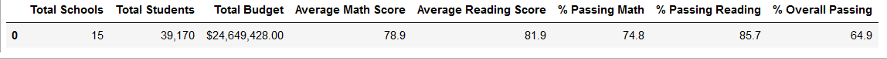
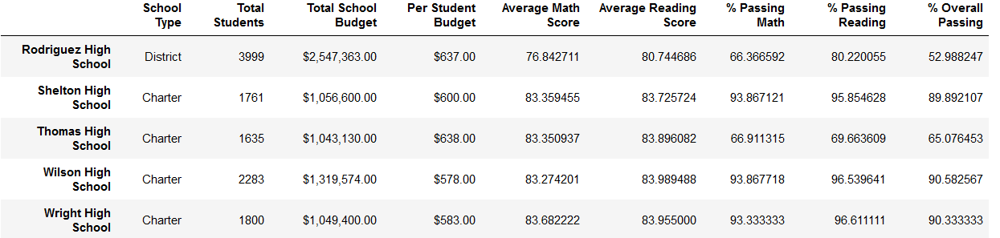

# School District Analysis

## Overview 

### Purpose

Some academic dishonesty has been reported at Thomas Highscool. To help uphold the state testing standards, we are going to help Maria replace the math and reading scores of the 9th graders at Thomas Highschool. We will then repeat the analysis to see if this our original analysis.

## Analysis

### School District Analysis Results
#### Old District Summary:

#### New District Summary:

As we can see, the district summary has changed but not by much. Every score went down except for reading, with the smallest decrease of .1% for Math Scores and the largest decrease of .3% for Students that passed Reading.

#### Old School Summary:

#### New School Summary:

#### Relative Performance

When only counting 10th-12th grade, there is not much change when compared to other schools

#### Replaced Scores Effects

-There is no change to math and reading scores by grade. It remains at 83.087886%

-There is very little change in scores by school pending and after formatting there is no change at all

-There is very little change in scores by school size and after formatting there is no change at all

-There is no change to district schools and there is very little change to charter schools which is neglected after formatting

## Summary

After replacing the scores, only 4 changes are made to the school district analysis. Average Math Score, % Passing Math, % Passing Read, and % Overall Passing all went down. The changes are very insignificant and in some cases unnoticeable after formatting.

